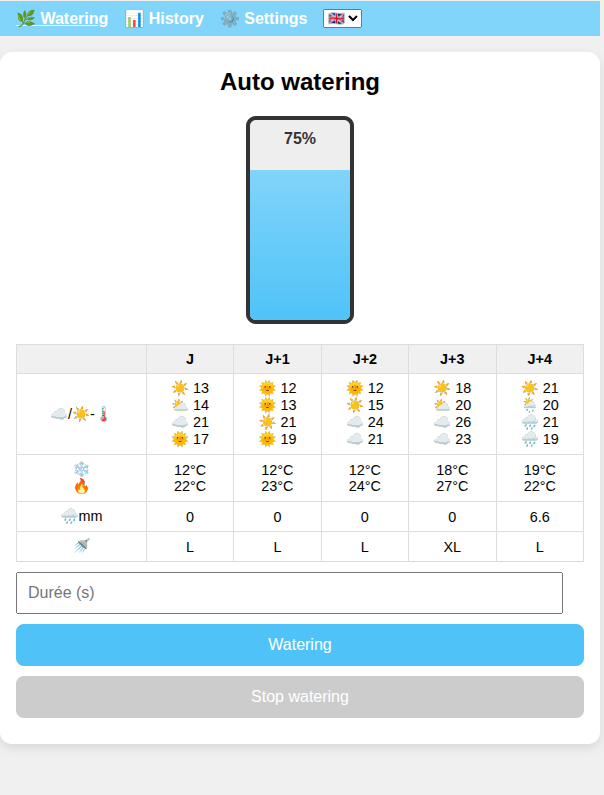
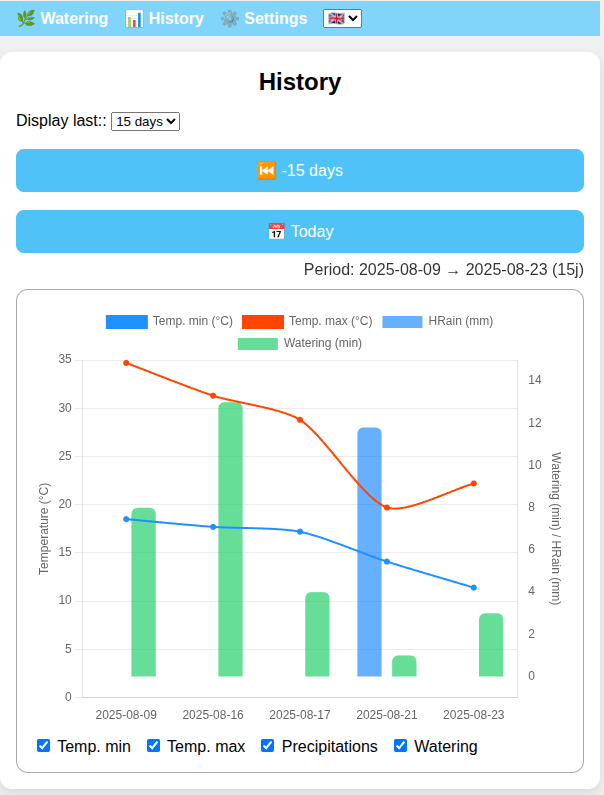
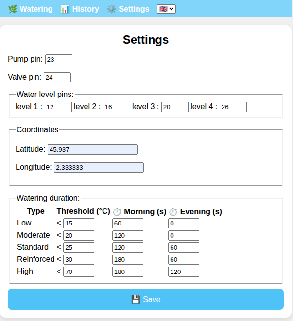
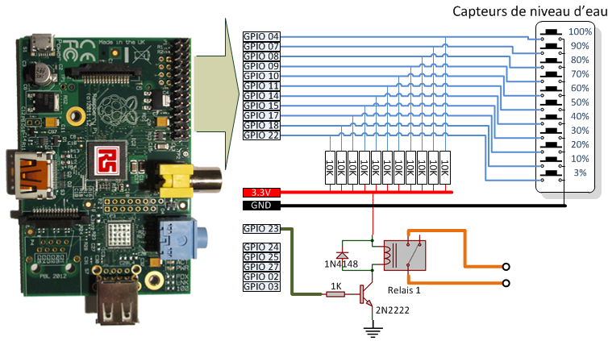
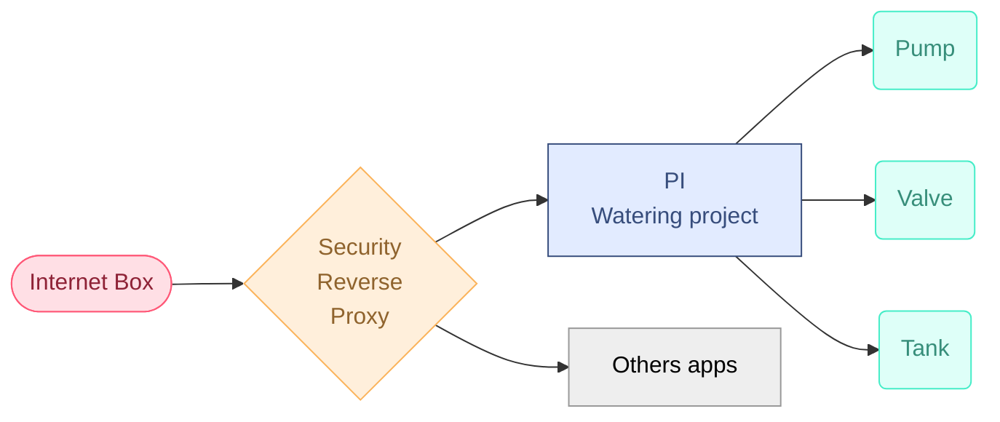

# Description

🌍 **This project automates the watering of a garden** using a Raspberry Pi connected to a rainwater collector.

🌊 It monitors water levels with floating switches and controls a solenoid valve and pump to distribute water as needed.

🔧 The system is designed for reliability and ease of installation, using readily available components and open-source software.

🌿 **Goal**: Optimize water usage and reduce manual intervention for garden irrigation.

💡 This project is completely inspired by Frederic JELMONI's project, available here: [Fred's Project](https://www.fred-j.org/index0364.html?p=364)

# Features

- 🌡️ **Retrieves daily temperature forecasts** from Open-Meteo to optimize watering schedules.
- 💦 **Adjusts watering duration and frequency** based on the predicted maximum temperature of the day.
- 🌊 **Displays real-time water tank level** using floating switches.
- 📊 **Shows a history of past watering events** for monitoring and analysis.

# Electronic and soldering

## Wiring for water detection in the tank

For this part, the best is to consult [Fred's Project](https://www.fred-j.org/index0364.html?p=364)

My customisation:

- I didn't use hat, I just solder cable directory on resistors, and protect with heat shrink tubes.
- I just use 4 floating switches. I need only these level:
  - Full, to potentielly stop collecting water
  - Empty, to stop all watering process
  - Two intermediates levels, for information
- To compute water level, we count number of floating switch. It simplifies wiring.

Here is the electronic diagram from Frédéric JELMONI's project:

## Wiring for pump and valve

My pump need to be plug in a standard electric outlet.

So, I wire an eletric outlet with the 5V Low Level trigger.

The valve has to be pluged with cable directly to the 5V low level trigger.

# Configuration

🖥️ **Tested on Raspberry Pi 1 and 4.**

🔧 **Middlewares installed:**

- nginx, as reverse proxy and protect access to sensitive action (watering, gpio pin settings, ...) from outside the lan network.
- gunicorn, as wsgi python server. As mentionned when you start a python Flask project, default webserver in Flask is not to use in production.
- mariadb, as database. Tried with SQLite, but it's a big crap, specially for datetime...

⚙️ **Specific Configuration:**

- Adding `www-data` user to the GPIO group

# 🏡 My architecture

## VM for security

Installed middlewares:

- NGinx: Reverse Proxy as unique entry-point, to handle basically on premise hosting redirection
  - It has reinforced nginx settings
  - Handle Let's Encrypt certificate
- Fail2ban: Trap and ip ban bots and malicious scan

## Raspberry

Installed middlewares:

- NGinx:
  - Reverse proxy, with security specific directive to forbid sensitive action coming outside LAN network: Watering, GPIO pin setting, coordinates, ...
  - this nginx configuration file is present in this repository, in deployment folder
- Gunicorn: As mentionned when you start a flask application in development, you must use a wsgi server for production environment.
  - Systemd config file for gunicorn is present in deployment folder.

## Deployment script

See `utils/deploy.sh`

# TODO

- [ ] 🚿 Compute water volume per watering (settings with pump capacity)

# DONE

- [ ] ~~👾 Add freshisness information (last data update)~~
- [ ] ~~📊 Add an endpoint to resfresh weather data~~
- [x] 👾 Analyze warning message in venv creation and dependancies installation
- [x] 🏗️ Go to a Domain Driven Design approach
- [x] 🇫🇷/🇬🇧 Fix translation bug
- [x] 🌦️ Give temperature and precipitation forecast for next 3 days
- [x] 🖼️ Add some pictures of the electrical device
- [x] 🌡️ Table from j-0 to J+4, with cloud, morning/evening, temperature
- [x] 🌡️ Get and display min/max temperature of the day
- [x] 📊 Review data model to integrate : start and stop for water tasks, temperature & precip
- [x] 📊 Review graph: add min max temperature, precipitation, last 30 days
- [x] 🔥 Add temperature to history graph
- [x] 💬 Investigate "Message flash" in flask for user error display
- [x] 👾 Fix front (flag, white main zone, textbox width, label for Rain, get current watering task...)
- [x] 📊 Review graph: improve data model
  - [x] #️⃣ create a separate table for temperature, precipitations
  - [x] #️⃣ import data
  - [x] 📊 make a join for history display
- [x] 🏎️ Add data in cache for data of the day
- [x] 🧪 Improve unittest
  - [x] 📊 Bind to test instance database
  - [x] 🧪 Add more unit tests
- [x] 🚚 Review deploy script
  - [x] 🚚 Remove sqlite backup
  - [x] ➕ Add mariadb backup
- [x] 🧊 Prevent watering when temperature < 0°
- [x] 🗓️ Settings for month watering: checks which month watering is enabled
- [x] 🏎️ Improve cached data
  - [x] 📊 Rename existing table to weather_data
  - [x] 📊 Create table to forecat_data
  - [x] ⏱️ Refresh weather data of the day for 6h.
  - [x] 🧪 Unit testing
  - [x] 🏎️ Cache forecat for 4 next days (j+1 to j+4) in table forecast_data
  - [x] ⏱️ Cache forecat data for 6h.
  - [x] ❌ Delete old forecast data
  - [x] 🧪 Unit testing
- [x] 💬 Fix message flash when non page redirect

# Inventory

## Electrical Devices ⚡

- 🍓 **Raspberry Pi (Model 3 here)**  
  [Amazon Link](https://www.amazon.fr/Raspberry-d%C3%A9marrage-dalimentation-Bo%C3%AEtier-Carte/dp/B0D3FNL84M/ref=sr_1_2?__mk_fr_FR=%C3%85M%C3%85%C5%BD%C3%95%C3%91&crid=3S23L4P12PUS0&dib=eyJ2IjoiMSJ9.kT6YfutOjwKMh4swpKAvfe4MWTcL9Qn2eVBMNza9rnmR2xQ8tfBYcpf-S0caQJmbl2ABO_21kc25TW9058TVVvfUxt_OSD6y50Te3-9VgekvnFajobpTCXCRj0c5KpaapXrdeUihgrsBx1yyBUGX3nDXO940POEuJ1ChD_cdvvjfFpSuZ1_5o8RmKQIHwZ-D3aJFmpPgiyVP9-Q5gEvUjNzYuCAbYVcgGf334BKGqKymdjKVJmdczC80vx8PT58iZKldsd90Ro_u0VCVZfivi47VPB11T5h1yZNtO8O0nu4.E7L9ewquZnq-MQsc_QW1mTkKcWBHqUTErdKYFI4JOSY&dib_tag=se&keywords=raspberry+pi+3&qid=1747340366&sprefix=raspberry+pi+3%2Caps%2C145&sr=8-2) ~72€
- 💧 **4 Floating Water Switch to detect water level**  
  [Amazon Link](https://www.amazon.fr/dp/B0DD6L4QP6?ref=ppx_yo2ov_dt_b_fed_asin_title) ~2x10€

- 🔌 **Wires to link from the tank to the Raspberry Pi**  
  [Amazon Link](https://www.amazon.fr/dp/B0087YHNGK?ref=ppx_yo2ov_dt_b_fed_asin_title) ~20€

- 🪛 **10KOhm Resistors**  
  [Amazon Link](https://www.amazon.fr/Innfeeltech-tol%C3%A9rance-r%C3%A9sistance-m%C3%A9tallique-exp%C3%A9riences/dp/B0CL6MDSHV/ref=sr_1_6?crid=SAL7SW5EALSY&dib=eyJ2IjoiMSJ9.2uI5wLbh1ZzeOeeTdK8FdKfEpB2sFTdmTbeF8KiuisjQHOjW-5b3PbFXRzhTGhflagZkvfwF3IT9-uQOBwBJJHSPbKUaamqH6BIdiNp5OeyFMTRZ4cuJeHDFNHBlzbeOTxYVSO5PwnQy24uW5VjUP4GtJ-abmp2ZSh5s4bVJQUct4oXQRUfts5gjoBdd1K2g7mg0vAzgloLncIEwCh4vPf7C-Y9oLvBFzF-6RHCRV503N0_8f3J8x1EbkWWoY7KlUcbIn4S2SYS1qggy4nb3Ar3F0csDVPc5dNkJOBf5yd0.XL2R1j1jQCv8NBD4vNaWzZttinIsnDOU-IobmY37_0s&dib_tag=se&keywords=10k+ohm&qid=1747340488&sprefix=10Ko%2Caps%2C167&sr=8-6) ~7€

- 🔋 **5V Low Level Trigger**  
  [Amazon Link](https://www.amazon.fr/dp/B07LB2RQYP?ref=ppx_yo2ov_dt_b_fed_asin_title) ~13€

- 🔧 **Heat Shrink Tubing**  
  [Amazon Link](https://www.amazon.fr/dp/B084GDLSCK?ref=ppx_yo2ov_dt_b_fed_asin_title) ~15€

- 📦 **IP55 Large Box**  
  [Amazon Link](https://www.amazon.fr/dp/B003O2X6T8?ref=ppx_yo2ov_dt_b_fed_asin_title) ~30€

- 🚿 **Solenoid Valve**  
  [Amazon Link](https://www.amazon.fr/dp/B0BRCPP7ZZ?ref=ppx_yo2ov_dt_b_fed_asin_title) ~25€

- 🔌 **Dupont Cables**  
  [Amazon Link](https://www.amazon.fr/Elegoo-Breadboard-Femelle-Longueur-Arduino/dp/B01JD5WCG2/ref=sr_1_6?__mk_fr_FR=%C3%85M%C3%85%C5%BD%C3%95%C3%91&crid=3F3VQBLGPD7IE&dib=eyJ2IjoiMSJ9.pd2dzP-V48Zr44UXshWSV2nrC0hngl5tCJM9KuGlRLjkMF9lrKrp7LevhilMgyJv19sxDeQy9mvJg240RSjI-qt9A3v_onx3R7IDdIpz_HNiDA4FFA9zM_4bnVav6mU3TV-x6UyP2t4QXTGZ7DV2pGrNrA6JCqXPd13YCoVDqhC79WO-aVOrChdo6-sF45Ni25QqzdLmWYmKRmfLxIM3cJFOr7DV2MuwLc0M3Val97_4izpj8WREu7an2LaYpWRUHpSeaEKV938cbpFk5rW4qJLn9plfaJm02z61TfhFeMU.6NvihRSiI2gIV4GAuCNdqb86gqzNhMwk0_QYk87JMB0&dib_tag=se&keywords=dupont+cable&qid=1747340279&sprefix=dupont+cabl%2Caps%2C166&sr=8-6) ~10€

- 🧰 **Breadboard**  
  [Amazon Link](https://www.amazon.fr/sspa/click?ie=UTF8&spc=MTozODkxOTg0NjM1NTc3MTE1OjE3NDczNDAzMjM6c3BfYXRmOjMwMDE0NDYxNzQ5OTkzMjo6MDo6&url=%2FMMOBIEL-Breadboard-Prototype-Circuit-Imprim%25C3%25A9%2Fdp%2FB0CPJRSLDX%2Fref%3Dsr_1_4_sspa%3F__mk_fr_FR%3D%25C3%2585M%25C3%2585%25C5%25BD%25C3%2595%25C3%2591%26crid%3D27VQGY2Z256Y1%26dib%3DeyJ2IjoiMSJ9.PMPmW7xq7soWcsaxx0d6BAq8GX1BL4vX3mAKIiJ9GI8xJpiMRmYlZpHtCcJEvaVgzMEuMigMkGvrXbjCWkrVxI8hgdgzGB-fVhc3djrMyq9oi8VjjUSmKjw8qflOmLJgGYbQxuBNeG-9E-6VgtBu3HRfJWJQvWu-crT6TOWRRL_78dpBcOH5_9tLDG2LffXjzSofvW1OpWYtOsb3nSVx9DR0MXqyqWJ_z5PVAD9M2vPpf9JYRzOxChEKbWPPdzBysSgh-jIhNZWUMSwaIpBUNds__o9ZMs4NP8V84ZxjWyY.vBnoHkHXB2Jt6lgxRY6SMrdF6muBJ5HJqI0Z5MHOGRQ%26dib_tag%3Dse%26keywords%3Dbreadboard%26qid%3D1747340323%26sprefix%3Dbreadboard%252Caps%252C143%26sr%3D8-4-spons%26sp_csd%3Dd2lkZ2V0TmFtZT1zcF9hdGY%26psc%3D1) ~7€

- ⚙️ **Metal Angle to screw floating water switch in the tank** [Amazon link](https://www.amazon.fr/Commentfer-Corniere-acier-Longueur-metres/dp/B01N02DVJ0/ref=sr_1_8?adgrpid=54274066497&dib=eyJ2IjoiMSJ9.CMTPT9A3hyAx02uRhQrUqqkbdL7cjakEN-tbNXJUjCed3KFRrxnGqjyw6Z6gBUcDhVJt7KJcqLMGMT2RpyMtDWK6TqF7c1BkkgeuFvKV6RxbbnLkR6m9p83-Pltv5cBdvCj1NL38897O5EHAHcDL9CNffUcFF8yMHnuPhnH41yd3TUFkwPuhv5hc4tkC4OMRyoYGe4UtsA3NAYIUr2Rfrbnhn36n0SoL5xfF108RBnC_3X3G4Ds85MMlBhXGs_aLWraIhz0ZNt0g-vu9CWaIPP3bCDgeuMpcpZtVgZeBNrU.J4NLCcRSlpPoViujKdJ7ybi9OgHjuGM1u8ZHifsvG-g&dib_tag=se&hvadid=275311450785&hvdev=c&hvexpln=0&hvlocphy=9109325&hvnetw=g&hvocijid=7129917880379167659--&hvqmt=b&hvrand=7129917880379167659&hvtargid=kwd-301836537022&hydadcr=16157_1764033&keywords=corniere%2Bacier&mcid=45667770b4e536f283d033576ed316c2&qid=1753217089&sr=8-8&th=1)

**Total: ~220€**

## Garden Devices 🌳

- 🚰 **Water Pump**  
  [Amazon Link](https://www.amazon.fr/dp/B08MV3VW7S?ref=ppx_yo2ov_dt_b_fed_asin_title) ~80€

- 🌿 **Garden Hose Connection**  
  [Amazon Link](https://www.amazon.fr/dp/B0BZKP7CNV?ref=ppx_yo2ov_dt_b_fed_asin_title) ~10€

- 💦 **Quick Garden Hose Connection**  
  [Amazon Link](https://www.amazon.fr/dp/B09J93FDK2?ref=ppx_yo2ov_dt_b_fed_asin_title) ~10€

**Total: ~100€**

## Tools 🔧

- 🔩 Screwdrivers
- 🔥 Soldering Iron
- 🧲 Tin
- 🔩 Screws
- 🔥 Heat Gun

# Credits

Pictures and diagrams from Frédéric JELMONI is used with his consent.
